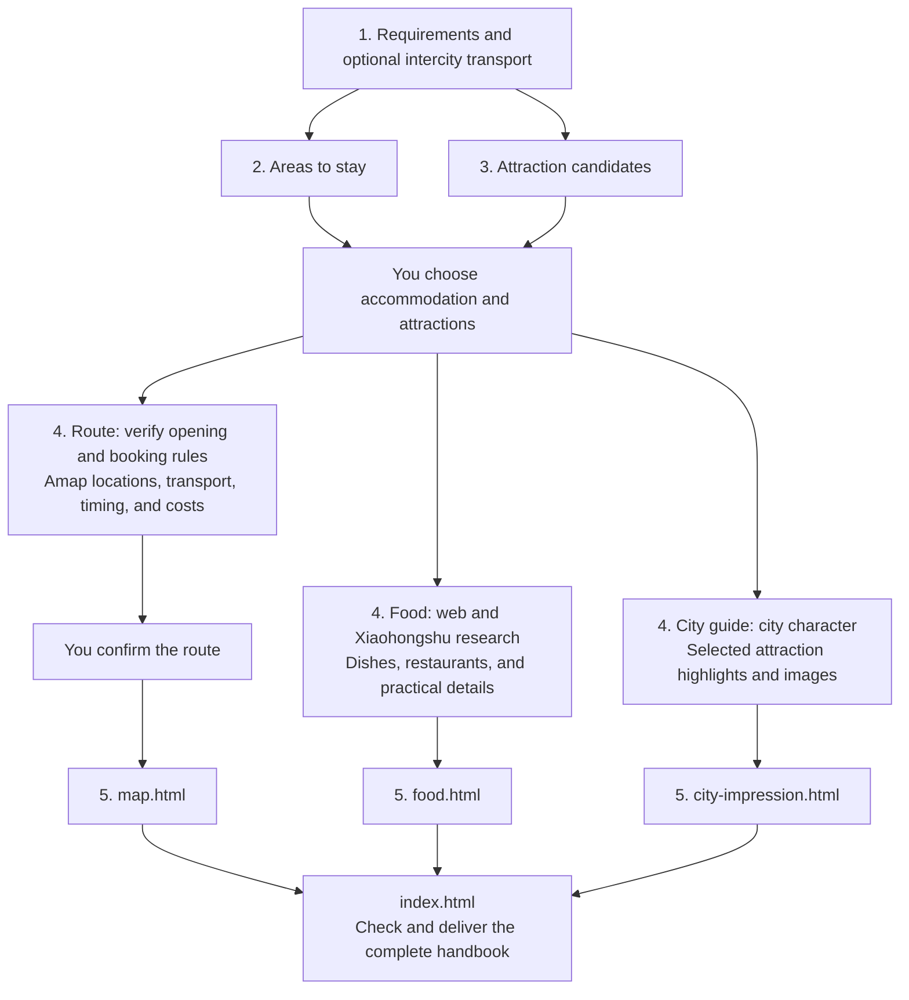

https://github.com/user-attachments/assets/ff0209ed-4060-4cf2-8acd-9d37f2ab72ae

<div align="center">

# 🧭 Marco Polo

**English** | [简体中文](README.zh-CN.md)

### Your next trip, mapped out.

**An open-source AI travel assistant that turns your preferences into a trip you can actually follow.**

Choose your stay and sights. Marco Polo connects real locations, transport, visiting hours, and reservations—then delivers an interactive map, food guide, and city guide in one travel handbook.


[](https://github.com/megumi-ben/marco-polo.skill/stargazers)

**[Explore the live demo](https://megumi-ben.github.io/marco-polo.skill/)** · **[Get started](#quick-start)** · [Watch the video](https://www.bilibili.com/video/BV1qvaH66Em5/) · [Contribute](CONTRIBUTING.md)

</div>

[](https://megumi-ben.github.io/marco-polo.skill/nanjing/)

<p align="center"><sub>Click to explore the Nanjing handbook · No setup needed · Demo content is in Chinese.<br>Screenshot: original Amap version. Public demo: OpenFreeMap. Lines show visit order; transport is queried separately during planning.</sub></p>

<table>
  <tr>
    <td width="33%" align="center"><a href="https://megumi-ben.github.io/marco-polo.skill/nanjing/"></a></td>
    <td width="33%" align="center"><a href="https://megumi-ben.github.io/marco-polo.skill/nanjing/food.html"></a></td>
    <td width="33%" align="center"><a href="https://megumi-ben.github.io/marco-polo.skill/nanjing/city-impression.html"></a></td>
  </tr>
  <tr>
    <td align="center"><b>Travel handbook</b><br><sub>Routes, food, and sights in one place.</sub></td>
    <td align="center"><b>Food guide</b><br><sub>Find local dishes and places to eat.</sub></td>
    <td align="center"><b>City guide</b><br><sub>Get a feel for the city and every stop.</sub></td>
  </tr>
</table>

<p align="center"><sub>Click a preview to open the interactive example</sub></p>

## Why Marco Polo

### 📍 Plans grounded in real places

**Routes start with coordinates.** Amap locations, entrances, and transport queries help group stops around your accommodation and reduce backtracking. Xiaohongshu adds travel experiences and local recommendations; FlyAI searches flights, trains, and hotels when needed.

### 🕒 Details that fit into a real day

**Opening hours, bookings, meals, and travel time are planned together.** Food streets belong around meals, night views after dark. A reservation checklist tells you what to book and when, with time left for breaks and departure.

### 🗺️ A handbook you can use on the trip

**See each day on an interactive map.** Explore place details, switch dates, and open the food and city guides from one entry point. Keep the itinerary, reservation checklist, and budget alongside it.

### 🎛️ Your trip, your choices

**Compare first, choose next, refine together.** Get a varied shortlist with reasons and tradeoffs. Keep existing bookings, change your hotel, swap a place, or leave an afternoon free; the affected plan and costs are updated together.

<details>
<summary>Explore the details: routes, reservations, budgets, and revisions</summary>

### 📍 Routes grounded in real locations, planned around your stay

Amap provides **POIs, coordinates, and entrances** for attractions, accommodation, and relevant transport hubs. The workflow checks ambiguous names and sites within larger attractions, then groups visits by location. Your chosen accommodation shapes where each day begins, which places belong together, and how you get back.

Walking, public transport, or driving routes between consecutive stops supply road distances and estimated travel times. Detours, entrances, and transfers all inform the plan. **The geography and the journey both matter.**

### 🕒 Detailed days with time for sights, food, bookings, and breaks

Museums during visiting hours, food streets around mealtimes, and evening views after dark: each stop is scheduled alongside opening hours, visit duration, reservation slots, and travel time. Meals, rest, queues, luggage collection, and getting to your train or flight also need room in the day.

A separate **attraction reservation checklist** records booking channels, ticket release rules, target slots, current status, and alternatives if a booking falls through. Prepare ahead, then see the relevant reminders in each day's itinerary.

### 🗺️ A polished, interactive map you can explore

The final **`map.html` webpage** shows each day in a different color, with visit order and direction arrows. Filter by date, locate a place from the itinerary, and open details about visit duration, reservations, and transport. Browser checks include readability on mobile.

Accommodation, attractions, and transport hubs have distinct markers. Selected food streets and night markets stay on the route; restaurant recommendations live in a separate guide. See the whole trip before departure, then find your next stop while traveling.

The **food guide** combines web research and Xiaohongshu experiences to recommend local dishes and specific restaurants, grouped by area or type. The **city guide** introduces the city and selected attractions with highlights, visiting tips, and matching images. Both pages can be read independently of the map.

**Useful details throughout the process:**

| Advantage | What it means for your trip |
|---|---|
| 🧭 **You keep the choices** | Candidates cover different interests and neighborhoods, with reasons, priorities, and tradeoffs. Explore options before narrowing them down. Existing tickets, hotels, and must-see places are respected. |
| 🔎 **Sources and uncertainty stay visible** | Xiaohongshu contributes experience and opinions; official sources verify opening hours, tickets, and reservations. Sources and lookup dates are retained. Unverified facts and outstanding bookings stay clearly marked. |
| 💰 **Clear costs per person** | Shared hotel and taxi costs are split across travelers; individual costs such as admission are recorded separately. Confirmed, estimated, and unknown amounts stay distinct, with checks against counting bundled tickets twice. |
| 🔄 **Changes stay consistent** | Changing accommodation, places, or dates updates the affected itinerary, routes, reservation targets, costs, and map. Existing bookings retain their actual status, and changes that affect them are explained. |

Your itinerary, reservation checklist, budget, map, and structured data are saved as local files. Keep the results and continue refining them.

Use it for a weekend away, a trip with friends, or a few days of sightseeing after you've already booked transport and accommodation. Transport you are arranging yourself can be skipped; an existing hotel becomes the starting point for planning.

</details>

## Quick start

### 1. Install Marco Polo

1. **[Download the Skill ZIP](https://megumi-ben.github.io/marco-polo.skill/downloads/marco-polo.zip)**.
2. Extract it and place the `marco-polo` folder in your project's `.agents/skills/` directory.

The entry point should be `.agents/skills/marco-polo/SKILL.md`. The package contains only the skill instructions, agent metadata, output specification, and map template—no demo website, screenshots, deployment files, or Git history.

### 2. Connect travel research and maps

Install **the Xiaohongshu skill bundle and both Amap skills**, then configure your own Amap credentials and Xiaohongshu login. Add **FlyAI** when you need transport or specific hotel searches. Place these skills alongside `marco-polo/`; see [Dependencies](#dependencies) for download links and setup.

Your agent also needs web research access to check official travel information.

### 3. Describe the trip you have in mind

For example:

```text
$marco-polo I'd like two relaxed days in Beijing, with historic architecture and parks.
I'll arrange travel to and from the city myself, but haven't chosen where to stay.
Help me plan.
```

Start with what you know. Marco Polo asks for the dates, group size, budget, and other information needed for the current stage. Later, you can continue with requests such as:

> My hotel has changed to this address. Update the first and last journeys each day, along with their costs.

<details>
<summary>Other locations, updates, and output folders</summary>

Use the **Skill ZIP** above for installation. GitHub’s **Code → Download ZIP** and `git clone` provide the full development repository, including the demo website; see [Contributing](CONTRIBUTING.md) if you want to work on the project.

- For personal use across projects, you can install to `~/.agents/skills/marco-polo/`. See the [official Codex skill locations](https://learn.chatgpt.com/docs/build-skills). If the skill does not appear, start a new session or restart Codex.
- To update, download a fresh Skill ZIP. Back up your existing installation outside the skill directories, then extract the new package. Preserve any local configuration you have added; old whole-repository installs can be replaced this way too.
- Results are created progressively in `travel_plan/<city-trip-id>/` under your working directory. Revisions reuse the same data, so you can continue where you left off.

</details>

## From one message to a trip

*An illustrative conversation. Opening hours, tickets, and routes are verified for the actual travel dates.*

**1. Describe the trip**

> I'd like two relaxed days in Beijing, with historic architecture and parks. I'll handle travel to and from the city, but haven't chosen where to stay.

Marco Polo asks for missing essentials such as dates and group size, compares 1–3 areas to stay, and offers a varied set of attractions with reasons, priorities, visit lengths, and initial booking information.

**2. Choose your stay and places, then review the daily plan**

> Let's stay around Wangfujing. I'd like the Palace Museum, Jingshan, Beihai, and the Temple of Heaven. Leave the others out for now.

After checking opening hours and reservations, Amap locations, entrances, and transport help group nearby stops with time for meals, breaks, and departure. You review the proposed itinerary:

| Day | Simplified example |
|---|---|
| Day 1 | Palace Museum in the morning → lunch and rest → Jingshan → Beihai |
| Day 2 | Temple of Heaven in the morning → lunch → free time, with a departure buffer based on your train |

**3. Confirm the route and take your trip files with you**

Get **a daily itinerary, reservation checklist, per-person budget, and travel handbook**. The map, food guide, and city guide have separate pages, with `index.html` as the entry point. Map loading, navigation, images, and mobile layout are checked. Outstanding bookings retain their actual status, and you can continue revising the trip.

<details>
<summary>Deliverables and what they are for</summary>

| Output | Purpose |
|---|---|
| Accommodation areas and attraction shortlist | Compare areas and places, with recommendation reasons and final selections |
| Reservation checklist | Know when, where, and which time slot to book before departure |
| Daily itinerary | Daily visits, transport, food, breaks, and alternatives |
| Per-person budget (CSV) | Confirmed, estimated, and unknown expenses, calculated per person |
| `map.html` | Locations, visit order, directions, and place details |
| Food recommendations and `food.html` | Local dishes and specific restaurants, grouped by area or type |
| `city-impression.html` | City character, selected attraction highlights, and images |
| `index.html` | One entry point for the map, food guide, and city guide |
| Trip data and progress | Facts, decisions, and progress for future revisions |

Files are created as needed. Transport comparisons are added only when requested. See the [output specification](references/outputs.md) for the full file conventions.

</details>

## Workflow

Five stages turn preferences into a travel handbook. Research accommodation and attractions in parallel, then develop the route, food guide, and city guide independently. Only the map waits for route confirmation; content pages can be built as soon as their research is ready.



Existing transport and hotels are respected. Urgent reservation deadlines are surfaced early. Restaurant recommendations are independent of the daily route; selected food streets, night markets, and fixed reservations remain part of planning. Approving an itinerary does not place an order or make a reservation.

## Dependencies

Install **both Amap skills and the Xiaohongshu skill bundle** for research and maps. Add **FlyAI** when you need transport, specific hotels, or travel products. Place dependencies alongside `marco-polo/`.

| Skill | Purpose | Download |
|---|---|---|
| `amap-lbs-skill` | POIs, coordinates, entrances, and transport routes | [Official Amap guide](https://lbs.amap.com/api/skill/ready-to-use/summary) · [Official ZIP](https://a.amap.com/jsapi/static/openClaw/amap-lbs-skill.zip) |
| `amap-jsapi-skill` | Interactive Amap webpages | [Official Amap guide](https://lbs.amap.com/api/skill/ready-to-use/summary) · [Official ZIP](https://a.amap.com/jsapi/static/openClaw/amap-jsapi-skill.zip) |
| `xiaohongshu-skills` | Experience-based research on accommodation, attractions, and food | [XHS Bridge implementation](https://github.com/autoclaw-cc/xiaohongshu-skills); use Code → Download ZIP and preserve the repository structure |
| `flyai` (optional) | Transport, specific hotels, and travel products | [Official setup](https://open.fly.ai/docs/quickstart) · [Source](https://github.com/alibaba-flyai/flyai-skill); use the `skills/flyai/` directory |

<details>
<summary>Amap setup and map preview</summary>

**Amap:** Extract both ZIPs into your skill directory. Create your own Web Service Key and Web JSAPI Key in the [Amap console](https://console.amap.com/dev/key/app). Install the LBS runtime dependencies as documented (`npm install` for versions with a `package.json`) and configure `AMAP_WEBSERVICE_KEY`. JSAPI needs its own key and the corresponding security configuration. See the [Web Service setup guide](https://lbs.amap.com/api/webservice/create-project-and-key).

When generating a map, copy `assets/amap-html-template/config.local.example.js` into the **trip output directory** as `config.local.js`. Set your own `jsapiKey` and either `securityJsCode` or an already deployed `serviceHost`. Keep the Web Service Key out of browser configuration. For public hosting, follow [Amap's security configuration guidance](https://lbs.amap.com/api/javascript-api-v2/guide/abc/prepare) for proxying and domain restrictions.

To preview the handbook, run `python3 -m http.server 8000 --bind 127.0.0.1` in the trip directory and open `http://127.0.0.1:8000/index.html`; `map.html` also opens directly. The base map requires internet access and valid configuration. The food and city guides can be read independently. Press Ctrl+C in the server terminal when finished.

</details>

<details>
<summary>Xiaohongshu installation and login</summary>

**Xiaohongshu:** Requires Python 3.11+, uv, and Chrome. Run `uv sync` in the dependency directory. Follow the [upstream README](https://github.com/autoclaw-cc/xiaohongshu-skills#%E5%AE%89%E8%A3%85) to load its `extension/` directory as an unpacked Chrome extension and enable XHS Bridge, then run `uv run python scripts/cli.py check-login`. Authentication and search subskills are already included. Sign in with your own account; this travel workflow does not need publishing, comments, or likes.

</details>

<details>
<summary>FlyAI setup (optional)</summary>

**FlyAI (optional):** After installing `skills/flyai/`, run `npm i -g @fly-ai/flyai-cli`, then check `flyai --help` for the available commands. Follow the [upstream instructions](https://github.com/alibaba-flyai/flyai-skill#quick-start) for queries and optional API key setup, using your own credentials.

</details>

<details>
<summary>Check that the dependencies work</summary>

After installation, verify a POI and route query, plus a Xiaohongshu search and note-detail retrieval. A successful login alone does not verify the research capability. Missing capabilities are reported in the plan.

</details>

<details>
<summary>Package structure and map template</summary>

```text
marco-polo/
├── SKILL.md                         Five-stage workflow
├── README.md                        English overview and setup
├── README.zh-CN.md                  Chinese overview and setup
├── agents/openai.yaml               Display name and invocation prompt
├── references/outputs.md            Output conventions
├── docs/                            Public website and interactive Nanjing demo
├── CONTRIBUTING.md                  Contribution and local preview guide
└── assets/
    ├── demo-map.png                 Nanjing map showcase
    └── amap-html-template/
        ├── map.html                Map template without itinerary data
        └── config.local.example.js Configuration placeholders
```

</details>

## Help make travel planning better

See the [contributing guide](CONTRIBUTING.md) for trip reports, focused pull requests, and local demo checks.

Want to try it on your next trip? **[⭐ Star Marco Polo](https://github.com/megumi-ben/marco-polo.skill)** to find it again when you're ready to plan.

[Share your experience](https://github.com/megumi-ben/marco-polo.skill/issues): what worked, where a route took a detour, or which booking detail was missing. Contributions to setup, route planning, and map presentation are welcome. Remove credentials, orders, and personal information before posting.

Start contributing with the [planning rules](SKILL.md) and [output specification](references/outputs.md).
