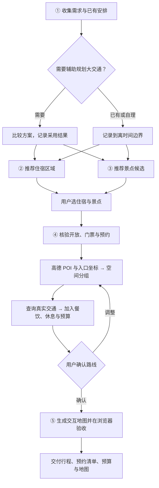

<div align="center">

# 🧭 马可波罗 · Marco Polo

**从「想去哪儿」到「今天怎么走」，一起把旅行安排明白。**


[看示例](#一次规划会怎样进行) · [看流程](#工作流) · [快速上手](#快速上手) · [安装依赖](#依赖安装)

</div>

马可波罗是一个中文单城市旅行规划 Skill：先研究住宿区域和景点，让你做选择，再结合**高德坐标与真实交通**安排每天的路线，最后交付行程、预约清单、人均预算和交互地图。

它关注的是为什么住这里、为什么去这些地方、为什么这样走。你只需用自然语言描述想法，无需填写表格或 JSON；已经订好的安排会被保留，后续修改只更新受影响的部分。

## 一次规划会怎样进行

下面是简化的虚构演示。截图使用公开景点位置与示意连线，不对应任何人的实际出行、酒店或订单，也不是已核验的旅行方案。

**① 你说需求**

> 想去北京玩两天，喜欢人文建筑和公园，节奏松一点。大交通自己安排，住宿区域还没选。

**② 马可波罗给选择**

比较 1—3 个住宿区域，说明交通、氛围和取舍；同时提供覆盖不同类型的景点候选、推荐理由、优先级和初步预约信息。初始候选有选择余地，不会因为每天只想去两三个地方，就只给刚好排满的名单。

**③ 你做筛选**

> 住宿选王府井一带。想去故宫、景山、北海和天坛，其他先不排。

**④ 马可波罗规划，再由你确认**

核验具体日期、入口和预约；查询高德坐标与实际交通，把相邻项目归在一起，加入用餐、休息和返程余量。对话先给简明路线及待确认事项，文件保留依据。预约尚未办理时，会明确标注。

| 日期 | 简化输出示例 |
|---|---|
| 第 1 天 | 上午故宫 → 午餐与休息 → 景山 → 北海 |
| 第 2 天 | 上午天坛 → 午餐 → 自由活动，按车次预留返程时间 |

> 你：这个分配可以，进入地图阶段。
>
> 马可波罗：按确认的安排生成地图，同步行程、预约清单与费用；尚未预约的项目仍标注未预约。

**⑤ 拿到地图和文件**


*地图骨架的虚构演示：左侧查看当天安排，右侧按日期筛选、点击点位；虚线表示顺序示意。实际规划使用查询到的交通路段，并区分真实路线与示意线。*

| 交付 | 用来做什么 |
|---|---|
| `住宿区域候选.md`、`景点清单.md` | 比较选择，保留推荐理由与最终名单 |
| `景点预约.md` | 出发前知道何时、去哪里、预约哪一场 |
| `每日行程.md` | 查看每天的景点、交通、餐饮、休息与备选 |
| `费用跟踪.csv` | 区分已定、预估和未知费用，按人均计算 |
| `map.html` | 查看位置、顺序、方向和点位详情 |
| `行程数据.json`、`行程状态.md` | 保存事实、决定和进度，便于继续修改 |

按需生成，不预先堆空文件；大交通比较只有需要时才增加。详细约定见 [输出规范](references/outputs.md)。

## 工作流



②③可以并行研究；已有酒店直接采用。紧迫的预约事项提前提醒，不必等候选全部筛完。用户确认的是方案，不代表已经下单或预约成功。

## 快速上手

**1. 放入 Skill 目录。** 解压发布包，将 `marco-polo/` 整个文件夹放到目标项目的 `.agents/skills/`。入口应为 `.agents/skills/marco-polo/SKILL.md`。也可安装到个人目录 `~/.agents/skills/marco-polo/`。[Codex 官方安装位置](https://learn.chatgpt.com/docs/build-skills)

**2. 配置依赖。** 按下方说明安装小红书和两个高德 Skill；需要查询大交通或具体酒店时再加 FlyAI。各依赖与 `marco-polo/` 并列，不放进它的内部。

**3. 开始对话。**

```text
$marco-polo 帮我规划一次单城市旅行。
先和我确认需求，推荐住宿区域和景点，等我选好后再安排路线。
```

也可以直接说“使用马可波罗，帮我规划旅行”，补充城市、日期、人数、偏好和已有安排。城市、日期尚不明确时，它会先帮助收集必要信息。

**4. 继续修改。** 例如：“酒店改到这个地址，帮我更新每天首尾交通和费用。”成果放在工作目录的 `travel_plan/<城市-行程标识>/`，后续沿用同一份数据。

新版安装时替换旧的马可波罗文件夹，先保留自己添加的本地配置。开发版叫 `travel-workflow`，此发布版叫 `marco-polo`，通常选择安装其中一个即可。未发现新 Skill 时，可重新开启会话或重启 Codex。

## 依赖安装

外部依赖共 **4 个 Skill 包**，本包不附带它们的源码或小红书操作指南。入口于 2026-09-27 核对，上游变化时以所下载版本的说明为准。

| Skill | 作用 | 下载来源 |
|---|---|---|
| `amap-lbs-skill` | POI、坐标、入口、实际交通 | [高德官方说明](https://lbs.amap.com/api/skill/ready-to-use/summary) · [官方 ZIP](https://a.amap.com/jsapi/static/openClaw/amap-lbs-skill.zip) |
| `amap-jsapi-skill` | 高德交互地图 | [高德官方说明](https://lbs.amap.com/api/skill/ready-to-use/summary) · [官方 ZIP](https://a.amap.com/jsapi/static/openClaw/amap-jsapi-skill.zip) |
| `xiaohongshu-skills` | 住宿、景点、美食经验 | [XHS Bridge 版本源码](https://github.com/autoclaw-cc/xiaohongshu-skills)，Code → Download ZIP，保留整个仓库结构 |
| `flyai` | 大交通、具体酒店和旅行产品 | [官方安装说明](https://open.fly.ai/docs/quickstart) · [源码](https://github.com/alibaba-flyai/flyai-skill)，下载后取 `skills/flyai/` |

**高德：** 将两个 ZIP 解压到 Skill 目录，在 [高德控制台](https://console.amap.com/dev/key/app)申请自己的 Web 服务 Key 和 Web 端 JSAPI Key。LBS 按其说明安装运行依赖（带 `package.json` 的版本可运行 `npm install`），配置 `AMAP_WEBSERVICE_KEY`。JSAPI 需要自己的 Key 及对应安全配置。[Web 服务配置说明](https://lbs.amap.com/api/webservice/create-project-and-key)

生成地图时，把本包 `assets/amap-html-template/config.local.example.js` 复制到**行程目录**并改名 `config.local.js`，填入自己的 `jsapiKey`，以及 `securityJsCode` 或已部署的 `serviceHost`。不在浏览器配置里放 Web 服务 Key；公开部署按[高德安全配置](https://lbs.amap.com/api/javascript-api-v2/guide/abc/prepare)使用适当的代理和域名限制。

**小红书：** 需要 Python 3.11+、uv 和 Chrome。在依赖目录运行 `uv sync`；按[上游 README](https://github.com/autoclaw-cc/xiaohongshu-skills#安装)将其 `extension/` 加载为 Chrome 已解压扩展，启用 XHS Bridge，再运行 `uv run python scripts/cli.py check-login`。登录和搜索子技能已在集合内，无需另外下载；登录态由使用者建立。本工作流不需要发布、评论或点赞。

**FlyAI（按需）：** 安装 `skills/flyai/` 后运行 `npm i -g @fly-ai/flyai-cli`，再用 `flyai --help` 确认当前命令。查询命令和可选 API Key 按[上游说明](https://github.com/alibaba-flyai/flyai-skill#quick-start)配置，使用自己的凭据。

安装后先验证一次 POI 与路段查询、小红书搜索与正文读取。只有登录成功或文件存在，还不足以确认对应能力可用。依赖缺失时工作流会说明缺口，不冒充完成研究或验证。

## 包内结构

```text
marco-polo/
├── SKILL.md                         五阶段工作流
├── README.md                        介绍、示例与安装
├── agents/openai.yaml               名称与调用提示
├── references/outputs.md            输入输出与文件规范
└── assets/
    ├── demo-map.png                 虚构演示截图
    └── amap-html-template/
        ├── map.html                不含行程数据的地图骨架
        └── config.local.example.js 凭据占位符
```

## 脱敏与分享

发布包保留经过交互测试的五阶段流程与输出规范，不包含真实 API Key、账号登录态、本机个人路径、用户行程或测试记录。历史模板中的旅行安排已移除；城市印象、美食等扩展页面按需生成。

地图骨架需要填入本次行程数据和使用者自己的配置；空骨架不算旅行地图交付。生成后在行程目录运行 `python3 -m http.server 8000 --bind 127.0.0.1`，打开 `http://127.0.0.1:8000/map.html` 预览，结束后在终端按 Ctrl+C。底图需要联网。

分享使用配套 `marco-polo.zip`。压缩包不含 `.git` 历史、本地配置和其他 Skill；已有发布目录的 Git 历史未改写，不属于本次脱敏内容。
