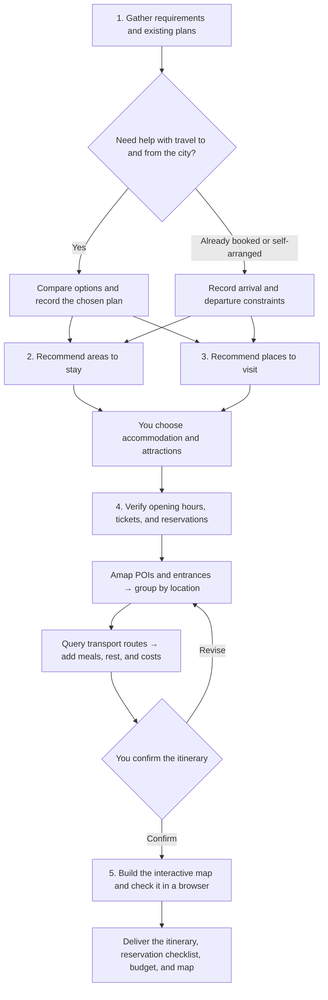

<div align="center">

# 🧭 Marco Polo

**English** | [简体中文](README.zh-CN.md)

### Your next trip, mapped out.

An **AI travel planning skill** that plans around your stay, real transport routes, and visiting times—then brings it all together on an interactive map.


[](https://github.com/megumi-ben/marco-polo.skill/stargazers)

[Why Marco Polo](#why-marco-polo) · [Quick start](#quick-start) · [See an example](#from-one-message-to-a-trip) · [Workflow](#workflow) · [Dependencies](#dependencies)

</div>


<p align="center"><sub>Nanjing itinerary showcase: daily colors, a visit timeline, and place details. Lines in this example show visit order; the planning workflow queries actual transport routes separately.</sub></p>

## Why Marco Polo

**Choose where to stay and what to see, then work out each day—with routes, timing, and reservations connected.**

| What makes it useful | What you get |
|---|---|
| 📍 **Routes grounded in real places** | Amap coordinates, entrances, and transport routes help group nearby stops around your accommodation, accounting for detours and transfers. |
| 🕒 **Days planned down to the details** | Opening hours, booking slots, meals, and evening views fit together, with room for breaks, queues, and departure. A separate reservation checklist helps you prepare ahead. |
| 🗺️ **A trip you can explore on a map** | A webpage with daily colors, date filters, place selection, and itinerary details—useful before departure and during the trip. |

Explore a varied set of places before choosing. Keep sources and per-person costs at hand. When plans change, update the itinerary, budget, and map together.

<details>
<summary>Explore the details: routes, reservations, budgets, and revisions</summary>

### 📍 Routes grounded in real locations, planned around your stay

Amap provides **POIs, coordinates, and entrances** for attractions, accommodation, and relevant transport hubs. The workflow checks ambiguous names and sites within larger attractions, then groups visits by location. Your chosen accommodation shapes where each day begins, which places belong together, and how you get back.

Walking, public transport, or driving routes between consecutive stops supply road distances and estimated travel times. Detours, entrances, and transfers all inform the plan. **The geography and the journey both matter.**

### 🕒 Detailed days with time for sights, food, bookings, and breaks

Museums during visiting hours, food streets around mealtimes, and evening views after dark: each stop is scheduled alongside opening hours, visit duration, reservation slots, and travel time. Meals, rest, queues, luggage collection, and getting to your train or flight also need room in the day.

A separate **attraction reservation checklist** records booking channels, ticket release rules, target slots, current status, and alternatives if a booking falls through. Prepare ahead, then see the relevant reminders in each day's itinerary.

### 🗺️ A polished, interactive map you can explore

The final **`map.html` webpage** shows each day in a different color, with visit order and direction arrows. Filter by date, locate a place from the itinerary, and open details about visit duration, reservations, and transport. Browser checks include readability on mobile.

Accommodation, attractions, food stops, and transport hubs have distinct markers. See the whole trip before departure, then find your next stop while traveling—with the written plan and its geography together.

**Useful details throughout the process:**

| Advantage | What it means for your trip |
|---|---|
| 🧭 **You keep the choices** | Candidates cover different interests and neighborhoods, with reasons, priorities, and tradeoffs. Explore options before narrowing them down. Existing tickets, hotels, and must-see places are respected. |
| 🔎 **Sources and uncertainty stay visible** | Xiaohongshu contributes experience and opinions; official sources verify opening hours, tickets, and reservations. Sources and lookup dates are retained. Unverified facts and outstanding bookings stay clearly marked. |
| 💰 **Clear costs per person** | Shared hotel and taxi costs are split across travelers; individual costs such as admission are recorded separately. Confirmed, estimated, and unknown amounts stay distinct, with checks against counting bundled tickets twice. |
| 🔄 **Changes stay consistent** | Changing accommodation, places, or dates updates the affected itinerary, routes, reservation targets, costs, and map. Existing bookings retain their actual status, and changes that affect them are explained. |

Your itinerary, reservation checklist, budget, map, and structured data are saved as local files. Keep the results and continue refining them.

Use it for a weekend away, a trip with friends, or a few days of sightseeing after you've already booked transport and accommodation. Transport you are arranging yourself can be skipped; an existing hotel becomes the starting point for planning.

</details>

## Quick start

### 1. Install Marco Polo

Run in your project directory:

```bash
mkdir -p .agents/skills
git clone https://github.com/megumi-ben/marco-polo.skill.git .agents/skills/marco-polo
```

### 2. Connect travel research and maps

Install **the Xiaohongshu skill bundle and both Amap skills**, then configure your own Amap credentials and Xiaohongshu login. Add **FlyAI** when you need transport or specific hotel searches. Place these skills alongside `marco-polo/`; see [Dependencies](#dependencies) for download links and setup.

Your agent also needs web research access to check official travel information.

### 3. Describe the trip you have in mind

For example:

```text
$marco-polo I'd like two relaxed days in Beijing, with historic architecture and parks.
I'll arrange travel to and from the city myself, but haven't chosen where to stay.
Help me plan.
```

Start with what you know. Marco Polo asks for the dates, group size, budget, and other information needed for the current stage. Later, you can continue with requests such as:

> My hotel has changed to this address. Update the first and last journeys each day, along with their costs.

<details>
<summary>ZIP installation, other locations, updates, and output folders</summary>

Alternatively, [download the ZIP](https://github.com/megumi-ben/marco-polo.skill/archive/refs/heads/main.zip), rename the extracted folder to `marco-polo`, and place it in `.agents/skills/`. The entry point should be `.agents/skills/marco-polo/SKILL.md`.

- For personal use across projects, you can install to `~/.agents/skills/marco-polo/`. See the [official Codex skill locations](https://learn.chatgpt.com/docs/build-skills). If the skill does not appear, start a new session or restart Codex.
- When updating an existing installation, preserve any local configuration you have added.
- Results are created progressively in `travel_plan/<city-trip-id>/` under your working directory. Revisions reuse the same data, so you can continue where you left off.

</details>

## From one message to a trip

*An illustrative conversation. Opening hours, tickets, and routes are verified for the actual travel dates.*

**1. Describe the trip**

> I'd like two relaxed days in Beijing, with historic architecture and parks. I'll handle travel to and from the city, but haven't chosen where to stay.

Marco Polo asks for missing essentials such as dates and group size, compares 1–3 areas to stay, and offers a varied set of attractions with reasons, priorities, visit lengths, and initial booking information.

**2. Choose your stay and places, then review the daily plan**

> Let's stay around Wangfujing. I'd like the Palace Museum, Jingshan, Beihai, and the Temple of Heaven. Leave the others out for now.

After checking opening hours and reservations, Amap locations, entrances, and transport help group nearby stops with time for meals, breaks, and departure. You review the proposed itinerary:

| Day | Simplified example |
|---|---|
| Day 1 | Palace Museum in the morning → lunch and rest → Jingshan → Beihai |
| Day 2 | Temple of Heaven in the morning → lunch → free time, with a departure buffer based on your train |

**3. Confirm the route and take your trip files with you**

Get **a daily itinerary, reservation checklist, per-person budget, and interactive map**. Map loading, date filters, place selection, and mobile layout are checked. Outstanding bookings retain their actual status, and you can continue revising the trip.

<details>
<summary>Deliverables and what they are for</summary>

| Output | Purpose |
|---|---|
| Accommodation areas and attraction shortlist | Compare areas and places, with recommendation reasons and final selections |
| Reservation checklist | Know when, where, and which time slot to book before departure |
| Daily itinerary | Daily visits, transport, food, breaks, and alternatives |
| Per-person budget (CSV) | Confirmed, estimated, and unknown expenses, calculated per person |
| `map.html` | Locations, visit order, directions, and place details |
| Trip data and progress | Facts, decisions, and progress for future revisions |

Files are created as needed. Transport comparisons are added only when requested. See the [output specification](references/outputs.md) for the full file conventions.

</details>

## Workflow

Five stages progressively turn preferences into a plan: understand the trip, research accommodation and attractions, arrange the selected places, then generate the map after route confirmation.



Accommodation and attraction research can run in parallel. An existing hotel is used directly. Urgent reservation deadlines are surfaced early. Approving an itinerary does not place an order or make a reservation.

## Dependencies

Install **both Amap skills and the Xiaohongshu skill bundle** for research and maps. Add **FlyAI** when you need transport, specific hotels, or travel products. Place dependencies alongside `marco-polo/`.

| Skill | Purpose | Download |
|---|---|---|
| `amap-lbs-skill` | POIs, coordinates, entrances, and transport routes | [Official Amap guide](https://lbs.amap.com/api/skill/ready-to-use/summary) · [Official ZIP](https://a.amap.com/jsapi/static/openClaw/amap-lbs-skill.zip) |
| `amap-jsapi-skill` | Interactive Amap webpages | [Official Amap guide](https://lbs.amap.com/api/skill/ready-to-use/summary) · [Official ZIP](https://a.amap.com/jsapi/static/openClaw/amap-jsapi-skill.zip) |
| `xiaohongshu-skills` | Experience-based research on accommodation, attractions, and food | [XHS Bridge implementation](https://github.com/autoclaw-cc/xiaohongshu-skills); use Code → Download ZIP and preserve the repository structure |
| `flyai` (optional) | Transport, specific hotels, and travel products | [Official setup](https://open.fly.ai/docs/quickstart) · [Source](https://github.com/alibaba-flyai/flyai-skill); use the `skills/flyai/` directory |

<details>
<summary>Amap setup and map preview</summary>

**Amap:** Extract both ZIPs into your skill directory. Create your own Web Service Key and Web JSAPI Key in the [Amap console](https://console.amap.com/dev/key/app). Install the LBS runtime dependencies as documented (`npm install` for versions with a `package.json`) and configure `AMAP_WEBSERVICE_KEY`. JSAPI needs its own key and the corresponding security configuration. See the [Web Service setup guide](https://lbs.amap.com/api/webservice/create-project-and-key).

When generating a map, copy `assets/amap-html-template/config.local.example.js` into the **trip output directory** as `config.local.js`. Set your own `jsapiKey` and either `securityJsCode` or an already deployed `serviceHost`. Keep the Web Service Key out of browser configuration. For public hosting, follow [Amap's security configuration guidance](https://lbs.amap.com/api/javascript-api-v2/guide/abc/prepare) for proxying and domain restrictions.

To preview a generated map, run `python3 -m http.server 8000 --bind 127.0.0.1` in the trip directory and open `http://127.0.0.1:8000/map.html`. The base map requires internet access. Press Ctrl+C in the server terminal when finished.

</details>

<details>
<summary>Xiaohongshu installation and login</summary>

**Xiaohongshu:** Requires Python 3.11+, uv, and Chrome. Run `uv sync` in the dependency directory. Follow the [upstream README](https://github.com/autoclaw-cc/xiaohongshu-skills#%E5%AE%89%E8%A3%85) to load its `extension/` directory as an unpacked Chrome extension and enable XHS Bridge, then run `uv run python scripts/cli.py check-login`. Authentication and search subskills are already included. Sign in with your own account; this travel workflow does not need publishing, comments, or likes.

</details>

<details>
<summary>FlyAI setup (optional)</summary>

**FlyAI (optional):** After installing `skills/flyai/`, run `npm i -g @fly-ai/flyai-cli`, then check `flyai --help` for the available commands. Follow the [upstream instructions](https://github.com/alibaba-flyai/flyai-skill#quick-start) for queries and optional API key setup, using your own credentials.

</details>

<details>
<summary>Check that the dependencies work</summary>

After installation, verify a POI and route query, plus a Xiaohongshu search and note-detail retrieval. A successful login alone does not verify the research capability. Missing capabilities are reported in the plan.

</details>

<details>
<summary>Package structure and map template</summary>

```text
marco-polo/
├── SKILL.md                         Five-stage workflow
├── README.md                        English overview and setup
├── README.zh-CN.md                  Chinese overview and setup
├── agents/openai.yaml               Display name and invocation prompt
├── references/outputs.md            Output conventions
└── assets/
    ├── demo-map.png                 Nanjing map showcase
    └── amap-html-template/
        ├── map.html                Map template without itinerary data
        └── config.local.example.js Configuration placeholders
```

</details>

## Help make travel planning better

Want to try it on your next trip? **[⭐ Star Marco Polo](https://github.com/megumi-ben/marco-polo.skill)** to find it again when you're ready to plan.

[Share your experience](https://github.com/megumi-ben/marco-polo.skill/issues): what worked, where a route took a detour, or which booking detail was missing. Contributions to setup, route planning, and map presentation are welcome. Remove credentials, orders, and personal information before posting.

Start contributing with the [planning rules](SKILL.md) and [output specification](references/outputs.md).
