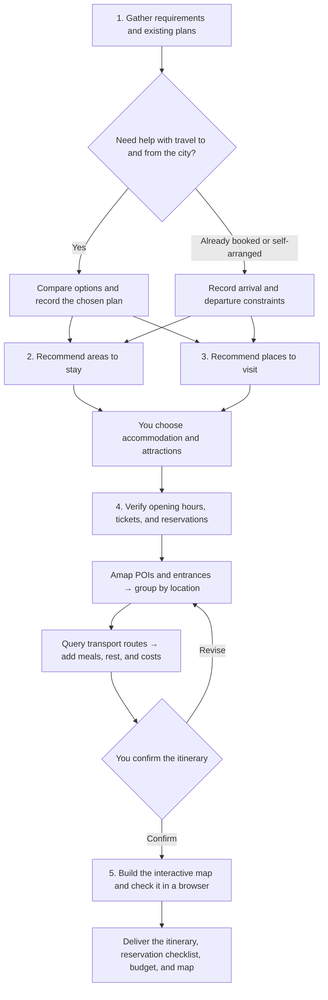

<div align="center">

# 🧭 Marco Polo · 马可波罗

**English** | [简体中文](README.zh-CN.md)

### Turn travel ideas into a trip you can follow.

**An AI travel planning skill that helps you choose, plan, and explore each day.**

Real locations · Thoughtful daily plans · An interactive map


[](https://github.com/megumi-ben/marco-polo.skill/stargazers)

[Why Marco Polo](#why-marco-polo) · [Quick start](#quick-start) · [See a trip take shape](#from-one-message-to-a-trip) · [Workflow](#workflow) · [Contribute](#help-make-travel-planning-better)

</div>

Saved plenty of travel guides? There are still decisions to connect before you leave: **Where should you stay? Which places are worth your time? How do they fit into a day? What needs booking?**

Marco Polo brings together Xiaohongshu travel experiences, official information, and Amap. It helps you choose an area to stay and places to visit, then plans each day around **your accommodation, the geography of your stops, and suitable visiting times**. Transport, food, reservations, and rest all have a place in the schedule. You get an editable trip plan and a map webpage you can click, filter, and explore.

**Your choices shape the trip. Marco Polo works through the details.** The current workflow focuses on Chinese-language, single-city itineraries, including nearby day trips. The skill instructions and output filenames are in Chinese.


<p align="center"><sub>Nanjing itinerary showcase: daily colors, a visit timeline, and place details. Lines in this example show visit order; the planning workflow queries actual transport routes separately.</sub></p>

## Why Marco Polo

Marco Polo puts **location accuracy, timing, a complete day, and a clear map** into one workflow. Every recommendation has to answer two questions: why does it suit you, and how does it fit into your day?

### 📍 Routes grounded in real locations, planned around your stay

Amap provides **POIs, coordinates, and entrances** for attractions, accommodation, and relevant transport hubs. The workflow checks ambiguous names and sites within larger attractions, then groups visits by location. Your chosen accommodation shapes where each day begins, which places belong together, and how you get back.

Walking, public transport, or driving routes between consecutive stops supply road distances and estimated travel times. Detours, entrances, and transfers all inform the plan. **The geography and the journey both matter.**

### 🕒 Detailed days with time for sights, food, bookings, and breaks

Museums during visiting hours, food streets around mealtimes, and evening views after dark: each stop is scheduled alongside opening hours, visit duration, reservation slots, and travel time. Meals, rest, queues, luggage collection, and getting to your train or flight also need room in the day.

A separate **attraction reservation checklist** records booking channels, ticket release rules, target slots, current status, and alternatives if a booking falls through. Prepare ahead, then see the relevant reminders in each day's itinerary.

### 🗺️ A polished, interactive map you can explore

The final **`map.html` webpage** shows each day in a different color, with visit order and direction arrows. Filter by date, locate a place from the itinerary, and open details about visit duration, reservations, and transport. Browser checks include readability on mobile.

Accommodation, attractions, food stops, and transport hubs have distinct markers. See the whole trip before departure, then find your next stop while traveling—with the written plan and its geography together.

**Useful details throughout the process:**

| Advantage | What it means for your trip |
|---|---|
| 🧭 **You keep the choices** | Candidates cover different interests and neighborhoods, with reasons, priorities, and tradeoffs. Explore options before narrowing them down. Existing tickets, hotels, and must-see places are respected. |
| 🔎 **Sources and uncertainty stay visible** | Xiaohongshu contributes experience and opinions; official sources verify opening hours, tickets, and reservations. Sources and lookup dates are retained. Unverified facts and outstanding bookings stay clearly marked. |
| 💰 **Clear costs per person** | Shared hotel and taxi costs are split across travelers; individual costs such as admission are recorded separately. Confirmed, estimated, and unknown amounts stay distinct, with checks against counting bundled tickets twice. |
| 🔄 **Changes stay consistent** | Changing accommodation, places, or dates updates the affected itinerary, routes, reservation targets, costs, and map. Existing bookings retain their actual status, and changes that affect them are explained. |

Your itinerary, reservation checklist, budget, map, and structured data are saved as local files. Keep the results and continue refining them.

Use it for a weekend away, a trip with friends, or a few days of sightseeing after you've already booked transport and accommodation. Transport you are arranging yourself can be skipped; an existing hotel becomes the starting point for planning.

## Quick start

### 1. Install Marco Polo

Run in your project directory:

```bash
mkdir -p .agents/skills
git clone https://github.com/megumi-ben/marco-polo.skill.git .agents/skills/marco-polo
```

Alternatively, [download the ZIP](https://github.com/megumi-ben/marco-polo.skill/archive/refs/heads/main.zip), rename the extracted folder to `marco-polo`, and place it in `.agents/skills/`. The entry point should be `.agents/skills/marco-polo/SKILL.md`.

### 2. Connect travel research and maps

Install **the Xiaohongshu skill bundle and both Amap skills**, then configure your own Amap credentials and Xiaohongshu login. Add **FlyAI** when you need transport or specific hotel searches. Place these skills alongside `marco-polo/`; see [Dependencies](#dependencies) for download links and setup.

You can start gathering requirements before every dependency is ready. Missing research or map capabilities are reported explicitly.

### 3. Describe the trip you have in mind

For the current Chinese-language workflow, try:

```text
$marco-polo 想去北京玩两天，喜欢人文建筑和公园，节奏松一点。
大交通自己安排，住宿区域还没选。帮我一起规划一下。
```

This means: “I'd like two relaxed days in Beijing, with historic architecture and parks. I'll arrange transport to and from the city myself, but haven't chosen where to stay. Help me plan.”

Start with what you know. Marco Polo asks for the dates, group size, budget, and other information needed for the current stage. Later, you can continue with requests such as:

> My hotel has changed to this address. Update the first and last journeys each day, along with their costs.

<details>
<summary>Other installation locations, updates, and output folders</summary>

- For personal use across projects, you can install to `~/.agents/skills/marco-polo/`. See the [official Codex skill locations](https://learn.chatgpt.com/docs/build-skills). If the skill does not appear, start a new session or restart Codex.
- When updating an existing installation, preserve any local configuration you have added.
- Results are created progressively in `travel_plan/<city-trip-id>/` under your working directory. Revisions reuse the same data, so you can continue where you left off.

</details>

## From one message to a trip

This fictional, shortened conversation illustrates the process. Follow-up questions about dates and travelers are omitted; opening hours, tickets, reservations, and routes still need verification for the actual travel dates.

**You:** I'd like two relaxed days in Beijing, with historic architecture and parks. I'll handle transport to and from the city, but haven't chosen where to stay.

**Marco Polo:** Compares 1–3 areas to stay, explaining transport access, atmosphere, and tradeoffs. It also offers a varied shortlist of attractions, with reasons, priorities, suggested visit lengths, and initial reservation information.

**You:** Let's stay around Wangfujing. I'd like the Palace Museum, Jingshan, Beihai, and the Temple of Heaven. Leave the others out for now.

**Marco Polo:** Checks opening hours and reservations, queries locations, entrances, and transport, and groups nearby visits while allowing time for meals, rest, and departure. It proposes this daily split for you to review:

| Day | Simplified example |
|---|---|
| Day 1 | Palace Museum in the morning → lunch and rest → Jingshan → Beihai |
| Day 2 | Temple of Heaven in the morning → lunch → free time, with a departure buffer based on your train |

**You:** That works. Go ahead with the map.

**Marco Polo:** Builds the map from the agreed plan, checks the base map, date filters, place selection, and mobile layout, and updates the itinerary, reservations, and budget. Bookings that have not been made remain marked as outstanding.

You receive **a daily route, booking preparation, cost estimates, and a map of your stops**. Decisions, sources, and outstanding tasks stay available for preparation and later changes.

<details>
<summary>Output files and what they are for</summary>

The current workflow uses Chinese filenames:

| Output | Purpose |
|---|---|
| `住宿区域候选.md`, `景点清单.md` | Compare areas and places, with recommendation reasons and final selections |
| `景点预约.md` | Know when, where, and which time slot to book before departure |
| `每日行程.md` | Daily visits, transport, food, breaks, and alternatives |
| `费用跟踪.csv` | Confirmed, estimated, and unknown expenses, calculated per person |
| `map.html` | Locations, visit order, directions, and place details |
| `行程数据.json`, `行程状态.md` | Facts, decisions, and progress for future revisions |

Files are created as needed. Transport comparisons are added only when requested. See the [output specification](references/outputs.md) for the full conventions in Chinese.

</details>

## Workflow

Five stages progressively turn preferences into a plan: understand the trip, research accommodation and attractions, arrange the selected places, then generate the map after route confirmation.



Accommodation and attraction research can run in parallel. An existing hotel is used directly. Urgent reservation deadlines are surfaced early. Approving an itinerary does not place an order or make a reservation.

## Dependencies

Marco Polo uses **four external skill packages**. Install them separately using the sources below. Links were checked on September 27, 2026; follow the documentation for the version you download if upstream instructions change.

| Skill | Purpose | Download |
|---|---|---|
| `amap-lbs-skill` | POIs, coordinates, entrances, and transport routes | [Official Amap guide](https://lbs.amap.com/api/skill/ready-to-use/summary) · [Official ZIP](https://a.amap.com/jsapi/static/openClaw/amap-lbs-skill.zip) |
| `amap-jsapi-skill` | Interactive Amap webpages | [Official Amap guide](https://lbs.amap.com/api/skill/ready-to-use/summary) · [Official ZIP](https://a.amap.com/jsapi/static/openClaw/amap-jsapi-skill.zip) |
| `xiaohongshu-skills` | Experience-based research on accommodation, attractions, and food | [XHS Bridge implementation](https://github.com/autoclaw-cc/xiaohongshu-skills); use Code → Download ZIP and preserve the repository structure |
| `flyai` | Transport, specific hotels, and travel products | [Official setup](https://open.fly.ai/docs/quickstart) · [Source](https://github.com/alibaba-flyai/flyai-skill); use the `skills/flyai/` directory |

**Amap:** Extract both ZIPs into your skill directory. Create your own Web Service Key and Web JSAPI Key in the [Amap console](https://console.amap.com/dev/key/app). Install the LBS runtime dependencies as documented (`npm install` for versions with a `package.json`) and configure `AMAP_WEBSERVICE_KEY`. JSAPI needs its own key and the corresponding security configuration. See the [Web Service setup guide](https://lbs.amap.com/api/webservice/create-project-and-key).

When generating a map, copy `assets/amap-html-template/config.local.example.js` into the **trip output directory** as `config.local.js`. Set your own `jsapiKey` and either `securityJsCode` or an already deployed `serviceHost`. Keep the Web Service Key out of browser configuration. For public hosting, follow [Amap's security configuration guidance](https://lbs.amap.com/api/javascript-api-v2/guide/abc/prepare) for proxying and domain restrictions.

To preview a generated map, run `python3 -m http.server 8000 --bind 127.0.0.1` in the trip directory and open `http://127.0.0.1:8000/map.html`. The base map requires internet access. Press Ctrl+C in the server terminal when finished.

**Xiaohongshu:** Requires Python 3.11+, uv, and Chrome. Run `uv sync` in the dependency directory. Follow the [upstream README](https://github.com/autoclaw-cc/xiaohongshu-skills#安装) to load its `extension/` directory as an unpacked Chrome extension and enable XHS Bridge, then run `uv run python scripts/cli.py check-login`. Authentication and search subskills are already included. Sign in with your own account; this travel workflow does not need publishing, comments, or likes.

**FlyAI (optional):** After installing `skills/flyai/`, run `npm i -g @fly-ai/flyai-cli`, then check `flyai --help` for the available commands. Follow the [upstream instructions](https://github.com/alibaba-flyai/flyai-skill#quick-start) for queries and optional API key setup, using your own credentials.

After installation, verify a POI and route query, plus a Xiaohongshu search and note-detail retrieval. A successful login alone does not verify the research capability. Missing capabilities are reported in the plan.

<details>
<summary>Package structure and map template</summary>

```text
marco-polo/
├── SKILL.md                         Five-stage workflow (Chinese)
├── README.md                        English overview and setup
├── README.zh-CN.md                  Chinese overview and setup
├── agents/openai.yaml               Display name and invocation prompt
├── references/outputs.md            Output conventions (Chinese)
└── assets/
    ├── demo-map.png                 Nanjing map showcase
    └── amap-html-template/
        ├── map.html                Map template without itinerary data
        └── config.local.example.js Configuration placeholders
```

</details>

## Help make travel planning better

Marco Polo has been shaped by real planning sessions: too few candidates, nearby places split across days, ambiguous names, and reservation details that are easy to miss. Those practical problems guide its continued improvement.

If it helps with your next trip, leave a **[⭐ Star](https://github.com/megumi-ben/marco-polo.skill)** so more travelers can find it.

[Feedback](https://github.com/megumi-ben/marco-polo.skill/issues) and contributions are welcome: tell us which stage worked well, where a plan fell short, or what you would change. Please remove API keys, login information, orders, and sensitive trip details before posting.

Start with [SKILL.md](SKILL.md) for the planning rules or the [output specification](references/outputs.md) for how the stages connect. Help turn the lessons from one trip into a better starting point for the next.
