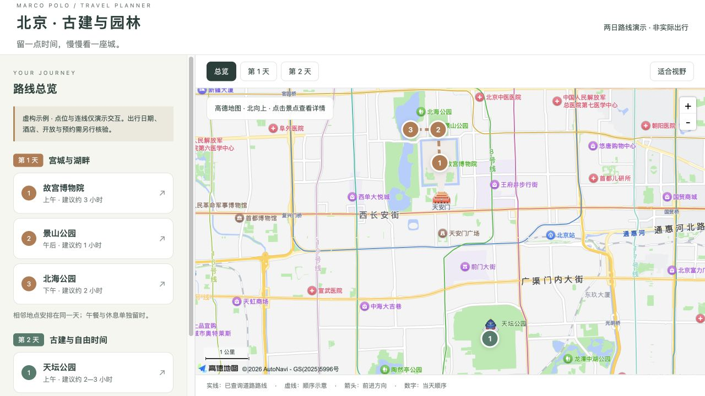
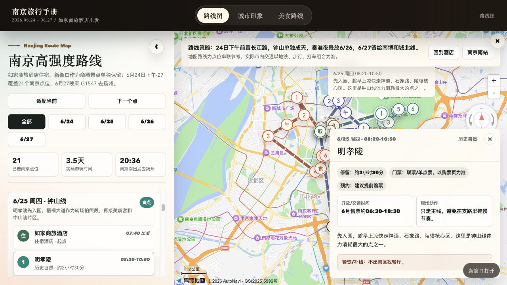
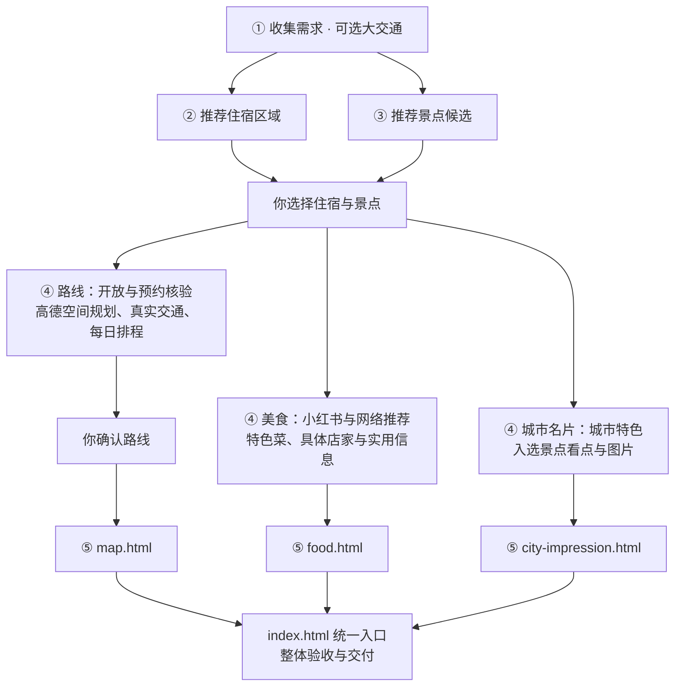

https://github.com/user-attachments/assets/ff0209ed-4060-4cf2-8acd-9d37f2ab72ae

<div align="center">

# 🧭 Marco Polo · 马可波罗

[English](README.md) | **简体中文**


[](https://github.com/megumi-ben/marco-polo.skill/stargazers)

**[在线体验](https://megumi-ben.github.io/marco-polo.skill/?lang=zh)** · **[快速上手](#快速上手)** · [视频演示](https://www.bilibili.com/video/BV1qvaH66Em5/) · [参与贡献](CONTRIBUTING.md#中文贡献说明)

</div>

[](https://megumi-ben.github.io/marco-polo.skill/nanjing/)

<p align="center"><sub>点击图片，直接体验南京旅行手册 · 无需安装<br>截图为原高德版本，在线示例使用 OpenFreeMap 底图；连线表示游览顺序。</sub></p>

<h2 align="center">世界那么大，我想去看看。</h2>

<p align="center"><strong>你决定向往哪里，马可波罗帮你安排怎么走。</strong></p>

住哪儿方便，哪些值得去，一天怎么走？把你的想法交给 **马可波罗**，一起挑住宿、选景点、安排吃逛，带走一份属于自己的旅行攻略。

这个 **AI 旅行规划 Skill** 将高德地图、小红书攻略、飞猪查询与官方信息结合起来，从最初的想法，一路规划到每日行程、预约清单和交互旅行手册。路线地图、美食攻略、城市名片，一个入口随手查看。**你决定怎么玩，马可波罗把细节安排好。**

<table>
  <tr>
    <td width="33%" align="center"><a href="https://megumi-ben.github.io/marco-polo.skill/nanjing/"></a></td>
    <td width="33%" align="center"><a href="https://megumi-ben.github.io/marco-polo.skill/nanjing/food.html"></a></td>
    <td width="33%" align="center"><a href="https://megumi-ben.github.io/marco-polo.skill/nanjing/city-impression.html"></a></td>
  </tr>
  <tr>
    <td align="center"><b>旅行手册</b><br><sub>路线、美食、城市，一个入口。</sub></td>
    <td align="center"><b>美食攻略</b><br><sub>吃什么、去哪吃，随手挑选。</sub></td>
    <td align="center"><b>城市名片</b><br><sub>看见城市风貌，读懂每一站。</sub></td>
  </tr>
</table>

<p align="center"><sub>南京案例展示 · 点击图片体验对应页面</sub></p>

## 核心优势

### 📍 真实依据

**基于高德坐标感知空间，围绕住宿与景点分布规划路线。** 先看清位置、片区和远近关系，再安排每天的游览顺序，并用实际交通校正距离与耗时，减少折返与绕行。

结合小红书热门攻略、亲历分享与避雷经验，发现值得住、值得逛的地方；通过飞猪查询机票、高铁和酒店。**攻略帮你选好去处，空间规划帮你把它们串成顺路的行程。**

### 🕒 细致安排

逐项核查开放时间、适合游玩的时段、停留时长、门票和预约规则，再把景点、街区、夜景排进合适的时间。交通、用餐、休息与返程一并统筹，提前交付预约清单。**细节提前想好，省去自己反复查资料、调时间、拼路线。**

### 🗺️ 精美地图

将完整行程呈现在一张精美的交互地图上：按天展示路线，标明游览顺序，点击查看景点与行程详情。配套每日攻略、预约清单和预算，手机与电脑都能浏览。**出发前一眼看清安排，旅行中随手找到下一站。**

### 🎛️ 自由定制

从机票酒店到景点美食，借助丰富的平台信息，按你的预算、兴趣和节奏组合方案。先给足候选，再由你选择；已有预订直接沿用，换酒店、加景点、留出自由时间，都能继续调整。**你的偏好决定行程，路线、费用与地图随之更新。**

## 功能介绍

- **交通与住宿规划**：比较机票、高铁、住宿区域与具体酒店，沿用已有预订。
- **景点与美食发现**：提供景点候选与推荐理由；结合小红书推荐特色美食和具体店家，按区域自由选择。
- **每日路线安排**：把选中的地点排进具体日期，安排顺序、交通、用餐与休息。
- **预约准备与费用测算**：整理预约入口、放票时间、目标场次与人均费用。
- **交互旅行手册**：路线地图、美食攻略、城市名片各自成页，通过统一入口浏览，配套可继续修改的行程文件。
- **行程调整**：处理酒店、日期和景点变化，更新受影响的路线、预约目标、费用与地图。

<details>
<summary>规划细节与信息核验</summary>

- **地点匹配**：核对同名地点、别名和景区入口，区分景区与内部游览点。依据坐标分组，再查步行、公交或驾车路线，把绕行和换乘计入安排。
- **信息来源**：小红书提供经验与口碑，官方来源核验开放、票务和预约。保留来源与查询时间，未知信息和未完成的预约明确标记。
- **预约准备**：记录预约入口、放票规则、目标时段、当前状态与失败备选；每日行程包含当天预约摘要。
- **时间与体力**：景点、用餐、休息、交通一起计时，预留排队、取行李与赶车余量，并准备可用的替代方案。
- **人均预算**：酒店、打车等共享费用按人数分摊；区分已定、预估与未知项，避免联票和景区内部项目重复计费。
- **地图交互**：按天分色，展示游览顺序和方向；住宿、景点与交通节点分别标识，支持日期筛选、列表定位和详情查看，并检查手机显示。顺序示意与实际道路路线分别说明。
- **独立内容页**：美食页介绍吃什么、去哪吃、人均与排队情况，普通店家不自动加入路线；城市名片展示城市特色和入选景点图文，两页均可独立浏览。
- **计划修改**：同步更新受影响的日程、交通、预约目标、费用与地图。已有预订保留实际状态，需要变更时说明影响。

已有车票、酒店可直接采用；需要时再比较大交通或查询具体酒店。成果保存为本地文件，便于带走、继续讨论和修改。

</details>

## 使用示例

**沈阳四天三晚：一次实际规划对话。** 以下整理了需求、选择与调整过程。

**① 说出需求**

> 四个人，10 月 1 日从哈尔滨到沈阳，4 日晚上返回，住三晚。高铁自己安排，住宿区域还没选。喜欢人文建筑、自然风光和风情街，每天 2—4 个地方，不要太赶。

**② 比较候选，做出选择**

马可波罗比较中街、青年大街和太原街三个住宿区域，并结合网络与小红书研究提供景点候选。你选择中街住宿，以及故宫、大帅府、九一八、北陵、中街、西塔、老北市和彩电塔夜市；辽宁省博物馆不纳入行程。

**③ 按你的想法调整**

> 大帅府放到第一个完整游玩日。最后一天只安排九一八，其他时间我自由决定。

查询高德坐标与实际交通，结合游玩时段，调整后确认的安排是：

| 日期 | 每日安排 |
|---|---|
| 10 月 1 日 | 抵达、入住 → 晚上中街吃逛 |
| 10 月 2 日 | 沈阳故宫 → 午餐 → 大帅府 → 回住宿休息 → 彩电塔夜市 |
| 10 月 3 日 | 北陵公园 → 西塔午餐与慢逛 → 休息 → 老北市 |
| 10 月 4 日 | 九一八历史博物馆 → 自由安排 → 取行李、返程 |

故宫与大帅府按空间位置安排在同一天；“大帅府”和“张学良旧居”归到同一地点；最后一天保留你要求的自由时间。

**④ 带走旅行手册**

美食攻略独立推荐特色吃食和具体店家，城市名片整理八处入选地点的看点与图片。路线确认后生成地图，三个页面通过统一入口浏览，配套行程、预约清单和费用记录，并检查桌面与手机显示。具体酒店、车次和未完成的预约保留为待落实项，明确后可继续补全交通与预算。

<details>
<summary>展开查看交付文件与用途</summary>

| 交付 | 用来做什么 |
|---|---|
| `住宿区域候选.md`、`景点清单.md` | 比较选择，保留推荐理由与最终名单 |
| `景点预约.md` | 出发前知道何时、去哪里、预约哪一场 |
| `每日行程.md` | 查看每天的景点、交通、餐饮、休息与备选 |
| `费用跟踪.csv` | 区分已定、预估和未知费用，按人均计算 |
| `map.html` | 查看位置、顺序、方向和点位详情 |
| `美食推荐.md`、`food.html` | 按区域或类型挑选特色美食与具体店家 |
| `city-impression.html` | 查看城市特色、入选景点的看点与图片 |
| `index.html` | 从统一入口切换路线地图、美食攻略和城市名片 |
| `行程数据.json`、`行程状态.md` | 保存事实、决定和进度，便于继续修改 |

文件随工作推进生成，不预先堆空文件；大交通比较只有需要时才增加。详细约定见 [输出规范](references/outputs.md)。

</details>

## 快速上手

### 1. 安装

1. **[下载 Skill 安装包](https://megumi-ben.github.io/marco-polo.skill/downloads/marco-polo.zip)**。
2. 解压，将 `marco-polo` 文件夹放入项目的 `.agents/skills/` 目录。

安装后应能找到 `.agents/skills/marco-polo/SKILL.md`。包内仅含技能说明、Agent 配置、输出规范和地图模板，不带演示网站、宣传截图、部署文件或 Git 历史。

### 2. 配置

准备具备联网搜索能力的 Agent，安装 **两个高德 Skill 和小红书 Skill 包**，配置自己的 Key 和登录状态。需要比较大交通或具体酒店时，再安装 **FlyAI**。见下方[依赖安装](#依赖安装)。

### 3. 开始规划

```text
$marco-polo 四个人去沈阳玩四天，喜欢人文建筑、风情街和美食。
大交通自己安排，住宿还没选。每天别太赶，帮我规划一下。
```

从已知的信息开始即可，马可波罗会补问当前阶段需要的内容。之后也可以直接说：“酒店换到这个地址，帮我调整路线。”

<details>
<summary>其他位置、更新与成果目录</summary>

安装请使用上面的 **Skill 安装包**。GitHub 的 **Code → Download ZIP** 和 `git clone` 下载的是包含网站的完整开发仓库；参与开发请看[贡献指南](CONTRIBUTING.md#中文贡献说明)。

- 也可安装到个人目录 `~/.agents/skills/marco-polo/`，参见 [Codex 官方安装位置](https://learn.chatgpt.com/docs/build-skills)。未发现新 Skill 时，可重新开启会话或重启 Codex。
- 更新时重新下载 Skill 安装包。先把原安装目录备份到 Skill 目录之外，再解压新版；保留自己添加的本地配置。之前克隆整个仓库安装的用户，也可这样换成精简包。
- 成果按阶段保存在工作目录的 `travel_plan/<城市-行程标识>/`；继续修改时沿用同一份数据，无需重新开始。

</details>

### 依赖安装

基础配置需要 **两个高德 Skill 和小红书 Skill 包**；需要查询大交通、具体酒店或旅行产品时，再安装 **FlyAI**。各依赖与 `marco-polo/` 并列放置。

| Skill | 作用 | 下载来源 |
|---|---|---|
| `amap-lbs-skill` | POI、坐标、入口、实际交通 | [高德官方说明](https://lbs.amap.com/api/skill/ready-to-use/summary) · [官方 ZIP](https://a.amap.com/jsapi/static/openClaw/amap-lbs-skill.zip) |
| `amap-jsapi-skill` | 高德交互地图 | [高德官方说明](https://lbs.amap.com/api/skill/ready-to-use/summary) · [官方 ZIP](https://a.amap.com/jsapi/static/openClaw/amap-jsapi-skill.zip) |
| `xiaohongshu-skills` | 住宿、景点、美食经验 | [XHS Bridge 版本源码](https://github.com/autoclaw-cc/xiaohongshu-skills)，Code → Download ZIP，保留整个仓库结构 |
| `flyai`（按需） | 大交通、具体酒店和旅行产品 | [官方安装说明](https://open.fly.ai/docs/quickstart) · [源码](https://github.com/alibaba-flyai/flyai-skill)，下载后取 `skills/flyai/` |

<details>
<summary>高德配置与地图预览</summary>

**高德：** 将两个 ZIP 解压到 Skill 目录，在 [高德控制台](https://console.amap.com/dev/key/app)申请自己的 Web 服务 Key 和 Web 端 JSAPI Key。LBS 按其说明安装运行依赖（带 `package.json` 的版本可运行 `npm install`），配置 `AMAP_WEBSERVICE_KEY`。JSAPI 需要自己的 Key 及对应安全配置。[Web 服务配置说明](https://lbs.amap.com/api/webservice/create-project-and-key)

生成地图时，把本包 `assets/amap-html-template/config.local.example.js` 复制到**行程目录**并改名 `config.local.js`，填入自己的 `jsapiKey`，以及 `securityJsCode` 或已部署的 `serviceHost`。不在浏览器配置里放 Web 服务 Key；公开部署按[高德安全配置](https://lbs.amap.com/api/javascript-api-v2/guide/abc/prepare)使用适当的代理和域名限制。

生成后，在行程目录运行 `python3 -m http.server 8000 --bind 127.0.0.1`，打开 `http://127.0.0.1:8000/index.html` 浏览手册，也可直接打开 `map.html`。地图底图需要联网与有效配置；美食、城市名片可独立阅读。结束后在终端按 Ctrl+C。

</details>

<details>
<summary>小红书安装与登录</summary>

**小红书：** 需要 Python 3.11+、uv 和 Chrome。在依赖目录运行 `uv sync`；按[上游 README](https://github.com/autoclaw-cc/xiaohongshu-skills#安装)将其 `extension/` 加载为 Chrome 已解压扩展，启用 XHS Bridge，再运行 `uv run python scripts/cli.py check-login`。登录和搜索子技能已在集合内，无需另外下载；登录态由使用者建立。本工作流不需要发布、评论或点赞。

</details>

<details>
<summary>FlyAI 配置（按需）</summary>

**FlyAI（按需）：** 安装 `skills/flyai/` 后运行 `npm i -g @fly-ai/flyai-cli`，再用 `flyai --help` 确认当前命令。查询命令和可选 API Key 按[上游说明](https://github.com/alibaba-flyai/flyai-skill#quick-start)配置，使用自己的凭据。

</details>

<details>
<summary>检查依赖是否可用</summary>

安装后先验证一次 POI 与路段查询、小红书搜索与正文读取。只有登录成功或文件存在，还不足以确认对应能力可用。依赖缺失时工作流会说明缺口，不冒充完成研究或验证。

</details>

<details>
<summary>包内结构与地图模板</summary>

```text
marco-polo/
├── SKILL.md                         五阶段工作流
├── README.md                        英文介绍、示例与安装
├── README.zh-CN.md                  中文介绍、示例与安装
├── agents/openai.yaml               名称与调用提示
├── references/outputs.md            输入输出与文件规范
├── docs/                            项目主页与南京交互示例
├── CONTRIBUTING.md                  贡献与本地预览指南
└── assets/
    ├── demo-map.png                 南京地图展示
    └── amap-html-template/
        ├── map.html                不含行程数据的地图骨架
        └── config.local.example.js 凭据占位符
```

</details>

## 工作流介绍

五个阶段，住宿与景点并行研究。选定之后，路线、美食、城市名片分别推进；地图等待路线确认，两个内容页资料就绪即可制作，最后通过统一入口交付。



已有车票、酒店沿用，记录到离时间；紧迫的预约提前提醒。美食按区域或类型组织，普通餐厅不自动进入每日路线，已选美食街、夜市和固定预约照常保留。确认方案不代表已经购票或预约。

详细规则见 [SKILL.md](SKILL.md)，文件约定见 [输出规范](references/outputs.md)。

---

喜欢这个项目，欢迎 **[⭐ Star](https://github.com/megumi-ben/marco-polo.skill)**。用过之后，也欢迎[分享反馈或贡献改进](https://github.com/megumi-ben/marco-polo.skill/issues)。

## 参与贡献

欢迎分享实际使用问题、完善安装说明，或优化规划与页面。查看[贡献指南](CONTRIBUTING.md#中文贡献说明)，从一个具体场景开始。
