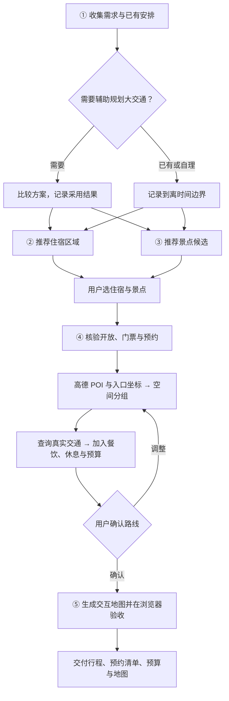

<div align="center">

# 🧭 Marco Polo · 马可波罗

[English](README.md) | **简体中文**

### 把旅行灵感，变成走得通的行程。

一个围绕住宿、真实交通与游玩时间安排行程，最终交付交互地图的 **AI 旅行规划 Skill**。


[](https://github.com/megumi-ben/marco-polo.skill/stargazers)

[核心优势](#为什么选择马可波罗) · [快速上手](#快速上手) · [看一个例子](#从一句话到一趟旅行) · [工作流](#工作流) · [依赖安装](#依赖安装)

</div>


<p align="center"><sub>南京行程展示：分日配色、游览时间轴与景点详情。此示例中的连线表示游览顺序；规划时会另行查询实际交通路线。</sub></p>

## 为什么选择马可波罗

**从住哪里、选哪些景点，到每天怎么走、什么时候预约，一起规划。**

| 核心优势 | 怎么帮你安排旅行 |
|---|---|
| 📍 **路线有依据** | 用高德查询坐标、入口和实际交通，围绕住宿位置把顺路的景点排在一起，考虑绕行与换乘。 |
| 🕒 **每天有细节** | 开放时间、预约场次、饭点和夜景一起安排，给休息、排队和赶车留出余量；提前整理独立预约清单。 |
| 🗺️ **成果看得见** | 交付按天分色的地图网页，可筛选日期、定位景点、查看行程详情，出发前和旅途中都能用。 |

景点先给足选择，再由你筛选。信息保留来源，预算按人均计算；换酒店或调整景点后，日程、费用与地图一起更新。

<details>
<summary>展开了解路线依据、预约、预算与修改细节</summary>

### 📍 更有依据的路线：从你住的地方开始规划

用高德查询景点、住宿与必要交通节点的 **POI、坐标和入口**，核对同名地点与景区内部点，再根据空间位置分组。每天从哪里出发、哪些景点适合放在一起、晚上如何回住处，都围绕你选定的住宿来考虑。

相邻地点之间继续查询实际步行、公交或驾车路线，校正道路距离与预计耗时，把绕路、入口位置和换乘成本纳入安排。**空间上顺路，交通上有依据。**

### 🕒 更细致的一天：景点、小吃、预约和休息一起安排

白天适合参观的场馆、饭点顺路的小吃街、适合晚上的夜景，会结合开放时间、停留时长、预约场次和交通耗时共同排程。午餐、休息、排队、取行李与赶车也有时间预算，让一天的安排有余量。

另有一份独立的 **景点预约清单**：记录预约入口、放票规则、目标时段、当前状态和失败后的备选。你能提前准备，也能在每日行程里看到当天的预约摘要。

### 🗺️ 更美观、更直观的交付：一张可以操作的旅行地图

最终生成清爽的 **`map.html` 地图网页**：每天用不同颜色展示，路线带顺序与方向箭头；可以按日期筛选、从行程列表定位景点，点击查看停留时间、预约和交通信息，并检查手机上的可读性。

住宿、景点、餐饮和交通节点在地图上有各自的标识。出发前看全局，旅行时查下一站，文字行程和空间位置可以一起看。

**还有这些贯穿全程的细节：**

| 优势 | 对你的实际帮助 |
|---|---|
| 🧭 **选择权在你手里** | 候选覆盖不同类型与片区，说明推荐理由、优先级和取舍。先给足选择空间，再由你筛选；已有车票、酒店和必去项目会被尊重。 |
| 🔎 **信息有来源，未知有标记** | 小红书提供经验与口碑，官方来源核验开放、票务和预约。保留查询时间与依据；尚未核验、尚未预约的事项明确可见，便于出发前复查。 |
| 💰 **人均费用算得清楚** | 酒店、打车等共享费用按人数分摊，门票等单人费用分别记录；区分已定、预估与未知项，避免联票、景区内部项目重复计费。 |
| 🔄 **改计划时保持一致** | 换住宿、增减景点或调整日期后，更新受影响的日程、路段、预约目标、费用与地图。已有预订保留实际状态，需变更时说明影响。 |

行程、预约清单、预算和地图都会保存为本地文件，并保留结构化数据。你可以带走成果，继续讨论和修改。

适合准备周末游、和朋友商量去哪里，或者已经订好车票酒店、只想把市内几天安排明白的人。已有大交通可以跳过比较，已有酒店可以直接进入景点选择。

</details>

## 快速上手

### 1. 安装马可波罗

在目标项目目录运行：

```bash
mkdir -p .agents/skills
git clone https://github.com/megumi-ben/marco-polo.skill.git .agents/skills/marco-polo
```

### 2. 接上旅行研究和地图能力

安装 **小红书、两个高德 Skill**，配置自己的高德 Key 和小红书登录状态；需要查询大交通或具体酒店时，再安装 **FlyAI**。各依赖与 `marco-polo/` 并列放置，下载入口和配置方式见[依赖安装](#依赖安装)。

使用的 Agent 还需具备联网搜索能力，以核验官方旅行信息。

### 3. 说说你想怎么旅行

```text
$marco-polo 想去北京玩两天，喜欢人文建筑和公园，节奏松一点。
大交通自己安排，住宿区域还没选。帮我一起规划一下。
```

从你已知的信息开始即可。马可波罗会补问当前阶段需要的日期、人数、预算等信息，再和你一起推进。后续只需继续说：

> 酒店换到这个地址，帮我调整每天的首尾交通和费用。

<details>
<summary>ZIP 安装、其他位置、更新与成果目录</summary>

也可以[下载 ZIP](https://github.com/megumi-ben/marco-polo.skill/archive/refs/heads/main.zip)，解压后将文件夹重命名为 `marco-polo`，放入 `.agents/skills/`。安装后应能找到 `.agents/skills/marco-polo/SKILL.md`。

- 也可安装到个人目录 `~/.agents/skills/marco-polo/`，参见 [Codex 官方安装位置](https://learn.chatgpt.com/docs/build-skills)。未发现新 Skill 时，可重新开启会话或重启 Codex。
- 安装新版时更新已有的马可波罗文件夹，先保留自己添加的本地配置。
- 成果按阶段保存在工作目录的 `travel_plan/<城市-行程标识>/`；继续修改时沿用同一份数据，无需重新开始。

</details>

## 从一句话到一趟旅行

*以下是简化的示例对话，实际开放、票务与路线按出行日期核验。*

**① 说出想法**

> 想去北京玩两天，喜欢人文建筑和公园，节奏松一点。大交通自己安排，住宿区域还没选。

马可波罗补齐日期、人数等必要信息，比较 1—3 个住宿区域，并给出有选择空间的景点候选，说明推荐理由、优先级、建议时长与初步预约信息。

**② 选好住宿和景点，确认每天的安排**

> 住宿选王府井一带。想去故宫、景山、北海和天坛，其他先不排。

核验开放与预约后，结合高德坐标、入口和交通，把相邻项目排在一起，给用餐、休息和返程留出时间。日程草案会先交给你确认：

| 日期 | 简化输出示例 |
|---|---|
| 第 1 天 | 上午故宫 → 午餐与休息 → 景山 → 北海 |
| 第 2 天 | 上午天坛 → 午餐 → 自由活动，按车次预留返程时间 |

**③ 确认路线，拿到完整旅行文件**

交付 **每日行程、预约清单、人均预算和交互地图**，检查地图加载、日期筛选、点位定位与手机显示。待办理的预约仍保留实际状态，之后也可以继续调整行程。

<details>
<summary>展开查看交付文件与用途</summary>

| 交付 | 用来做什么 |
|---|---|
| `住宿区域候选.md`、`景点清单.md` | 比较选择，保留推荐理由与最终名单 |
| `景点预约.md` | 出发前知道何时、去哪里、预约哪一场 |
| `每日行程.md` | 查看每天的景点、交通、餐饮、休息与备选 |
| `费用跟踪.csv` | 区分已定、预估和未知费用，按人均计算 |
| `map.html` | 查看位置、顺序、方向和点位详情 |
| `行程数据.json`、`行程状态.md` | 保存事实、决定和进度，便于继续修改 |

按需生成，不预先堆空文件；大交通比较只有需要时才增加。详细约定见 [输出规范](references/outputs.md)。

</details>

## 工作流

五个阶段，逐步收敛：先理解需求，再研究住宿和景点，选好后安排路线，确认后生成地图。



②③可以并行研究；已有酒店直接采用。紧迫的预约事项提前提醒，不必等候选全部筛完。用户确认的是方案，不代表已经下单或预约成功。

## 依赖安装

基础配置需要 **两个高德 Skill 和小红书 Skill 包**；需要查询大交通、具体酒店或旅行产品时，再安装 **FlyAI**。各依赖与 `marco-polo/` 并列放置。

| Skill | 作用 | 下载来源 |
|---|---|---|
| `amap-lbs-skill` | POI、坐标、入口、实际交通 | [高德官方说明](https://lbs.amap.com/api/skill/ready-to-use/summary) · [官方 ZIP](https://a.amap.com/jsapi/static/openClaw/amap-lbs-skill.zip) |
| `amap-jsapi-skill` | 高德交互地图 | [高德官方说明](https://lbs.amap.com/api/skill/ready-to-use/summary) · [官方 ZIP](https://a.amap.com/jsapi/static/openClaw/amap-jsapi-skill.zip) |
| `xiaohongshu-skills` | 住宿、景点、美食经验 | [XHS Bridge 版本源码](https://github.com/autoclaw-cc/xiaohongshu-skills)，Code → Download ZIP，保留整个仓库结构 |
| `flyai`（按需） | 大交通、具体酒店和旅行产品 | [官方安装说明](https://open.fly.ai/docs/quickstart) · [源码](https://github.com/alibaba-flyai/flyai-skill)，下载后取 `skills/flyai/` |

<details>
<summary>高德配置与地图预览</summary>

**高德：** 将两个 ZIP 解压到 Skill 目录，在 [高德控制台](https://console.amap.com/dev/key/app)申请自己的 Web 服务 Key 和 Web 端 JSAPI Key。LBS 按其说明安装运行依赖（带 `package.json` 的版本可运行 `npm install`），配置 `AMAP_WEBSERVICE_KEY`。JSAPI 需要自己的 Key 及对应安全配置。[Web 服务配置说明](https://lbs.amap.com/api/webservice/create-project-and-key)

生成地图时，把本包 `assets/amap-html-template/config.local.example.js` 复制到**行程目录**并改名 `config.local.js`，填入自己的 `jsapiKey`，以及 `securityJsCode` 或已部署的 `serviceHost`。不在浏览器配置里放 Web 服务 Key；公开部署按[高德安全配置](https://lbs.amap.com/api/javascript-api-v2/guide/abc/prepare)使用适当的代理和域名限制。

生成后，在行程目录运行 `python3 -m http.server 8000 --bind 127.0.0.1`，打开 `http://127.0.0.1:8000/map.html` 预览地图。底图需要联网；结束后在终端按 Ctrl+C。

</details>

<details>
<summary>小红书安装与登录</summary>

**小红书：** 需要 Python 3.11+、uv 和 Chrome。在依赖目录运行 `uv sync`；按[上游 README](https://github.com/autoclaw-cc/xiaohongshu-skills#安装)将其 `extension/` 加载为 Chrome 已解压扩展，启用 XHS Bridge，再运行 `uv run python scripts/cli.py check-login`。登录和搜索子技能已在集合内，无需另外下载；登录态由使用者建立。本工作流不需要发布、评论或点赞。

</details>

<details>
<summary>FlyAI 配置（按需）</summary>

**FlyAI（按需）：** 安装 `skills/flyai/` 后运行 `npm i -g @fly-ai/flyai-cli`，再用 `flyai --help` 确认当前命令。查询命令和可选 API Key 按[上游说明](https://github.com/alibaba-flyai/flyai-skill#quick-start)配置，使用自己的凭据。

</details>

<details>
<summary>检查依赖是否可用</summary>

安装后先验证一次 POI 与路段查询、小红书搜索与正文读取。只有登录成功或文件存在，还不足以确认对应能力可用。依赖缺失时工作流会说明缺口，不冒充完成研究或验证。

</details>

<details>
<summary>包内结构与地图模板</summary>

```text
marco-polo/
├── SKILL.md                         五阶段工作流
├── README.md                        英文介绍、示例与安装
├── README.zh-CN.md                  中文介绍、示例与安装
├── agents/openai.yaml               名称与调用提示
├── references/outputs.md            输入输出与文件规范
└── assets/
    ├── demo-map.png                 南京地图展示
    └── amap-html-template/
        ├── map.html                不含行程数据的地图骨架
        └── config.local.example.js 凭据占位符
```

</details>

## 一起让旅行规划更好用

如果你想在下一次旅行试试它，欢迎点一个 **[⭐ Star](https://github.com/megumi-ben/marco-polo.skill)**，方便回来找到项目。

欢迎[分享使用反馈](https://github.com/megumi-ben/marco-polo.skill/issues)：哪个地方安排得好、哪里绕了路、什么预约信息遗漏了。也欢迎贡献安装体验、路线规划和地图展示方面的改进。反馈中请移除凭据、订单及个人信息。

想参与改进，可以从 [规划规则](SKILL.md) 和 [输出规范](references/outputs.md) 开始。
